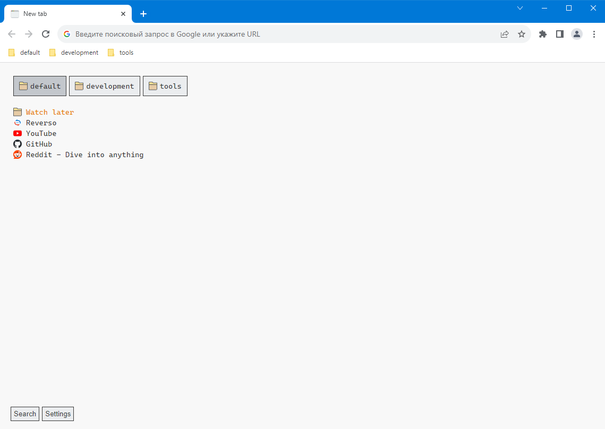

## Simple start page with bookmarks

Google chrome extension.

### Installation Instructions

1. Download zip file from [releases](https://github.com/darteil/browser-start-page/releases).
2. Unzip the file and you should have a folder named `browser-start-page`.
3. Go to the extensions page (`chrome://extensions`).
4. Enable Developer Mode.
5. Drag the `browser-start-page` folder anywhere on the page to import it (do not delete the folder afterwards).

### Screenshot

### Using libraries

[preact](https://github.com/preactjs/preact),
[htm](https://github.com/developit/htm)

### License

MIT License, Copyright (c) 2022 Romanov Yuri
